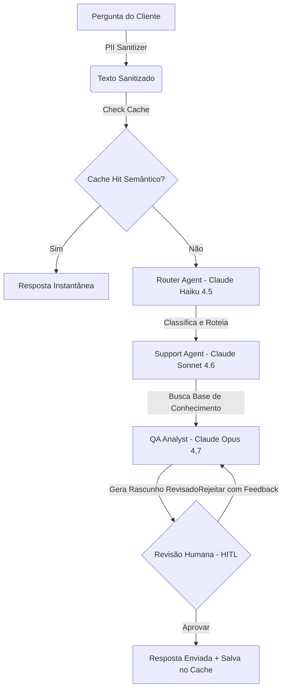

# Customer Support Crew - Dashboard & Multi-Agent Pipeline

Este repositório contém a implementação completa de um **Crew de Atendimento ao Cliente** inteligente e de alta performance construído com **CrewAI** e alimentado pelos modelos **Anthropic Claude 4.x** (Haiku 4.5, Sonnet 4.6 e Opus 4.7).

O projeto é integrado a uma interface web interativa premium baseada em **Glassmorphism e Dark Mode**, servida por uma API REST **FastAPI** assíncrona, incorporando higienização de dados pessoais (LGPD/GDPR), cache semântico inteligente e intervenção humana assíncrona (**HITL**).

---

## 🏗️ Arquitetura de Agentes (Sequential Crew)

O atendimento é executado em um fluxo sequencial rígido onde cada agente desempenha um papel crítico:



1. **Router Agent (Claude Haiku 4.5)**: Classifica as dúvidas entre suporte técnico, reembolso e geral, direcionando o fluxo.
2. **Support Agent (Claude Sonnet 4.6)**: Consulta a base de conhecimento simulada utilizando a ferramenta customizada `DocsSearchTool` para obter instruções oficiais.
3. **QA Analyst Agent (Claude Opus 4.7)**: Realiza uma auditoria de qualidade técnica, garante conformidade com as políticas corporativas, realiza blindagem contra injeção de prompts e formata o e-mail de suporte final em Markdown.

---

## 🔒 Recursos de Destaque

*   **PII Anonymizer (Segurança)**: HigienizaCPFs, e-mails, telefones e cartões de crédito antes do envio aos LLMs externos.
*   **LLM-Powered Semantic Cache**: Motor de busca semântica em cache local que poupa 100% de chamadas repetidas de API e responde em milissegundos.
*   **Web Console Terminal**: Streaming ao vivo dos logs de pensamento intermediário dos agentes diretamente no navegador.
*   **Human-In-The-Loop (HITL)**: Permite ao operador revisar, aprovar ou dar feedbacks de correção que o Claude Opus aplica de forma dinâmica.

---

## 📁 Estrutura do Repositório

```text
customer-support-crew/
├── app/                       # Pacote principal da aplicação
│   ├── __init__.py
│   ├── main.py                # Inicialização do FastAPI, CORS, middlewares e estáticos
│   ├── core/                  # Utilitários centrais (.env, Segurança PII, Tracing)
│   │   ├── __init__.py
│   │   ├── config.py          # Configurações globais e caminhos do projeto
│   │   ├── security.py        # Higienizador de dados sensíveis (PII Anonymizer)
│   │   └── observability.py   # Setup global de telemetria OTel e Langfuse
│   ├── cache/                 # Motor de persistência e validação de cache
│   │   ├── __init__.py
│   │   └── semantic_cache.py  # Carregador e buscador no Cache Semântico local
│   ├── crew/                  # Camada de IA (CrewAI)
│   │   ├── __init__.py
│   │   ├── orchestrator.py    # Orquestrador da Crew de atendimento
│   │   └── tools.py           # DocsSearchTool de busca na base de conhecimento
│   ├── jobs/                  # Gerenciador de execução paralela
│   │   ├── __init__.py
│   │   └── manager.py         # Orquestração de threads em background e logs
│   └── api/                   # Interface e roteamento de requisições HTTP
│       ├── __init__.py
│       ├── routes.py          # Endpoints REST e serving do frontend
│       └── schemas.py         # Modelos de validação de dados Pydantic
├── config/                    # Arquivos YAML de configuração da IA
│   ├── agents.yaml            # Definição de papéis, objetivos e backstories dos agentes
│   └── tasks.yaml             # Escopo de entregáveis e inputs das tarefas
├── data/                      # Bancos de dados locais
│   └── semantic_cache.json    # Banco local de cache semântico em formato JSON
├── static/                    # Arquivos estáticos servidos no navegador
│   ├── css/
│   │   └── style.css          # Estilos Glassmorphism e Dark Mode premium
│   └── js/
│       └── app.js             # Lógica assíncrona de polling, logs em tempo real e HITL
├── templates/
│   └── index.html             # Dashboard HTML5 do painel operacional
├── tests/                     # Pasta de testes automatizados
│   └── test_api.py            # Script de teste de rotas de API e fluxo HITL
├── .env                       # Variáveis de ambiente protegidas (Anthropic & CrewAI Tracing)
├── .gitignore                 # Proteção de credenciais e dependências locais
├── context.md                 # Diário técnico de desenvolvimento e bugs pendentes
├── main.py                    # Entrypoint limpo (redireciona para app.main:app)
└── requirements.txt           # Dependências do Python
```

---

## 🚀 Guia de Instalação e Execução

### Requisitos Prévios
* Python 3.10 ou superior instalado.

### 1. Clonar e Acessar o Repositório
Abra o seu terminal na pasta raiz do projeto:
```powershell
cd customer-support-crew
```

### 2. Configurar o Ambiente Virtual
Crie e ative a `venv`:
```powershell
# Criar venv
python -m venv venv

# Ativar venv no Windows (PowerShell)
.\venv\Scripts\Activate.ps1
```

### 3. Instalar Dependências
```powershell
pip install -r requirements.txt
```

### 4. Configurar Variáveis de Ambiente
Renomeie ou crie o arquivo [`.env`](file:///c:/Users/lemos/OneDrive/Área de Trabalho/Customer-support-crew/.env) na raiz do projeto e insira suas credenciais reais:
```env
# Chave de API Anthropic (Claude 4.x)
ANTHROPIC_API_KEY="sua_chave_aqui"

# Observabilidade: Tracing Nativo do CrewAI
CREWAI_TRACING_ENABLED=true
```

### 5. Configurar o Tracing Nativo do CrewAI
Para autenticar sua máquina no painel de traces da plataforma oficial do **CrewAI**, execute no terminal:
```powershell
crewai login
```
Isso abrirá o navegador para vincular seu ambiente ao dashboard nativo de monitoramento de agentes da CrewAI.

### 6. Executar o Servidor Web
Para evitar erros de enconding de emojis no terminal do Windows, utilize o comando unificado abaixo:
```powershell
$env:PYTHONIOENCODING='utf-8'; .\venv\Scripts\python -m uvicorn main:app --reload
```

### 7. Usar e Testar a Aplicação
1. **Interface Web**: Abra o seu navegador e acesse:
   🔗 [**http://127.0.0.1:8000/**](http://127.0.0.1:8000/)
   Você poderá inserir dúvidas (ex: *"Como configuro o SDK no Python?"*), ver o streaming dos logs no painel visual e validar o fluxo de HITL (Human-in-the-Loop).

2. **Testes de API**: Para rodar o script de teste automatizado de endpoints, com a API rodando no terminal principal, abra outro terminal e execute:
   ```powershell
   .\venv\Scripts\python tests/test_api.py
   ```

Tudo pronto! Seus traces serão transmitidos automaticamente e de forma nativa para o painel de traces da plataforma **CrewAI**.
