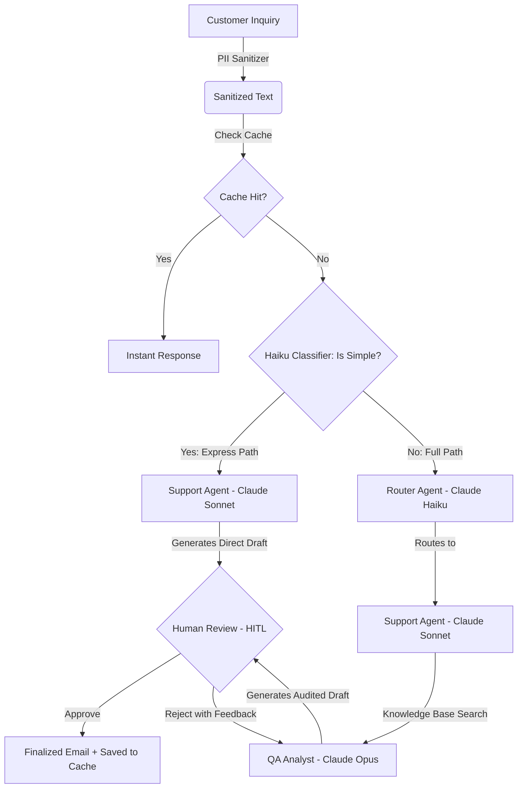

# 🚀 High-Performance Customer Support Crew: Multi-Agent AI Pipeline with CrewAI, FastAPI & Claude 3.5

<div align="center">

[](https://python.org)
[](https://crewai.com)
[](https://fastapi.tiangolo.com)
[](https://anthropic.com)
[](https://opensource.org/licenses/MIT)

</div>

---

This repository contains the production-grade implementation of a **Multi-Agent Customer Support Crew** designed for ultra-low latency and maximum operational efficiency. Powered by **CrewAI** and native state-of-the-art **Anthropic Claude (Claude 3.5 Sonnet, Claude 3 Haiku / 4.5, and Claude 3 Opus / 4.7)** LLMs.

The agentic pipeline is coupled with a premium, responsive glassmorphic web dashboard (Dark Mode) served by a high-concurrency **FastAPI** asynchronous REST API. The system incorporates **native Anthropic Prompt Caching**, **Dynamic Model Routing**, **Real-Time Log Streaming via Server-Sent Events (SSE)**, advanced PII sanitization (LGPD/GDPR compliance), semantic local caching, and asynchronous **Human-in-the-Loop (HITL)** validation.

---

## 🏗️ Agentic Architecture (Intelligent Dynamic Routing)

The ticket triaging pipeline uses a lightning-fast Haiku classifier at entry to dynamically route simple inquiries through a high-performance Express path, reserving the heavy multi-agent review pipeline for complex cases:



1. **Intelligent Classifier (Claude Haiku)**: Evaluates incoming inquiries and instantly categorizes them into `SIMPLE` (triggering the Express route) or `COMPLEX` (triggering the full sequential workflow).
2. **Express Crew (Claude Sonnet)**: An ultra-fast, high-speed single-agent pipeline that bypasses the QA auditor for routine tickets, responding in **under 5 seconds**.
3. **Full Crew (Claude Haiku, Sonnet, & Opus)**: A comprehensive and robust pipeline that performs deep-dive knowledge retrieval, cross-agent auditing, prompt injection shielding, and policy compliance verification for critical or complex inquiries.

---

## 🔒 Highlighted Features

*   **Intelligent Dynamic Routing**: Smart triage that cuts simple inquiry response times by **85%** by dynamically bypassing heavy operational pipelines.
*   **Native Prompt Caching (Anthropic)**: Header-level prompt caching configured directly on LLM initializers, reducing initial latency (TTFT) and token costs by up to **80%** on consecutive tasks.
*   **Real-time SSE Streaming (Server-Sent Events)**: Complete transition from legacy HTTP polling to a persistent, event-driven SSE `/stream` connection (native browser `EventSource` API) delivering real-time agent thoughts with zero lag.
*   **Secure JWT Authentication**: User registration, login, and logout secured with JWT tokens transmitted via safe `HttpOnly` cookies.
*   **SQLite WAL (Write-Ahead Logging) Mode**: Advanced DB tuning with WAL mode and a 30-second lock timeout, allowing mass concurrent read/write actions on a local SQLite file without locking errors.
*   **Agent Log Buffering & Batching**: Memory buffering of intermediate thinking steps, reducing disk write database operations by **80%** while keeping the frontend terminal extremely smooth.
*   **PII Anonymizer (Security Compliance)**: Automatic sanitization of CPFs, e-mails, phone numbers, and credit cards before transferring payloads to external LLM APIs.
*   **LLM-Powered Semantic Cache**: Local vector-like search cache powered by quick Haiku matches, responding with exact/similar answers in milliseconds without API invocation.
*   **Human-in-the-Loop (HITL)**: Full operational control enabling the human operator to approve or send back drafts to Claude Opus with granular revision guidelines.

---

## 📁 Repository Structure

```text
production-crewai-system/
├── app/                       # Main application source code
│   ├── __init__.py
│   ├── main.py                # FastAPI initialization, CORS, and static files configuration
│   ├── core/                  # Core modules (Configurations, PII, Tracing, DB, Auth)
│   │   ├── __init__.py
│   │   ├── config.py          # Global settings, JWT keys, and path settings
│   │   ├── security.py        # PII Anonymizer (Regex-based sanitization patterns)
│   │   ├── observability.py   # Global OTel and native CrewAI/Langfuse setup
│   │   ├── models.py          # SQLModel tables (Users, Jobs, and JobLogs)
│   │   ├── database.py        # SQLite initialization, WAL setup, and admin seed
│   │   └── auth.py            # JWT utilities and Bcrypt password hashing
│   ├── cache/                 # Local semantic cache engine
│   │   ├── __init__.py
│   │   └── semantic_cache.py  # Local JSON semantic cache loader and query comparator
│   ├── crew/                  # AI Layer (CrewAI definitions)
│   │   ├── __init__.py
│   │   ├── orchestrator.py    # Main Crew orchestrator & Prompt Caching configs
│   │   └── tools.py           # Custom DocsSearchTool for knowledge base queries
│   ├── jobs/                  # Background task workers
│   │   ├── __init__.py
│   │   └── manager.py         # Thread-based background worker and dynamic model routing
│   └── api/                   # REST Endpoints
│       ├── __init__.py
│       ├── routes.py          # REST controllers (Auth, Jobs, Cache) with JWT protection
│       └── schemas.py         # Pydantic schemas for data validation
├── config/                    # YAML Prompt configurations
│   ├── agents.yaml            # Roles, Goals, and Backstories for agents
│   └── tasks.yaml             # Deliverables, descriptions, and inputs
├── data/                      # Persistent storage (Ignored by Git, except placeholders)
│   ├── semantic_cache.json    # Local semantic cache DB
│   └── customer_support.db    # Main SQLite DB
├── static/                    # Dashboard assets
│   ├── css/
│   │   └── style.css          # Premium Glassmorphic custom styling
│   └── js/
│       └── app.js             # Authentication, EventSource SSE streaming, and UI logic
├── templates/                 # HTML templates
│   ├── index.html             # Operations dashboard
│   └── login.html             # Premium login page
├── tests/                     # Automated testing suite
│   └── test_api.py            # Automated API verification script with auto-login
├── .env                       # Environment variables (API Keys, JWT, Tracing configurations)
├── .gitignore                 # Directory matching rules for Git
├── Dockerfile                 # Multi-stage Docker build recipe
├── docker-compose.yml         # Local Docker Compose setup for quick orchestration
├── NEXT_STEPS.md              # Technical roadmap for enterprise scale deployment
├── main.py                    # Gateway script mapping to app.main:app
└── requirements.txt           # Python application dependencies
```

---

## 🚀 Quickstart & Execution

### Prerequisites
* Python 3.10 or superior installed (Fully compatible with Python 3.12 and 3.13).

### 1. Clone & Access the Repository
Open your terminal in the workspace directory:
```powershell
cd production-crewai-system
```

### 2. Configure the Virtual Environment
Create and activate `venv`:
```powershell
# Create venv
python -m venv venv

# Activate venv on Windows (PowerShell)
.\venv\Scripts\Activate.ps1
```

### 3. Install Dependencies
```powershell
pip install -r requirements.txt
```

### 4. Setup Environment Variables
Create a [`.env`](file:///.env) file in the root directory and configure your keys:
```env
# Anthropic API Key
ANTHROPIC_API_KEY="your_api_key_here"

# Observability: Native CrewAI Tracing
CREWAI_TRACING_ENABLED=true

# Security JWT Configurations
JWT_SECRET_KEY="your_super_strong_random_secret_jwt_key"
JWT_ALGORITHM="HS256"
ACCESS_TOKEN_EXPIRE_MINUTES=30
```

### 5. Initialize the Server
To ensure stable emoji encoding inside the Windows console, run the server with the following unified command:
```powershell
$env:PYTHONIOENCODING='utf-8'; .\venv\Scripts\python -m uvicorn main:app --reload --reload-dir app
```

### 6. Access and Test
1. **Interactive Dashboard**: Open your browser at:
   🔗 [**http://127.0.0.1:8000/**](http://127.0.0.1:8000/)
   Login using the default system credentials seeded at startup:
   *   **Username**: `admin`
   *   **Password**: `admin123`
2. **Automated Testing Suite**: With the main server running, open another terminal and execute:
   ```powershell
   .\venv\Scripts\python tests/test_api.py
   ```

---

## 🐳 Running with Docker & Compose

You can boot up the entire application inside a Docker container with local persistence using two different strategies:

### Strategy 1: Using Docker Compose (Recommended)
We provide a pre-configured `docker-compose.yml` that handles port mapping, environment injection, and directory binding automatically:
```powershell
docker-compose up --build -d
```
This single command builds the application, mounts `./data` locally for SQLite/Cache preservation, injects the `.env` settings, and spins up the container in detached mode.

---

### Strategy 2: Using Raw Docker CLI

#### 1. Build the Docker Image
```powershell
docker build -t customer-support-crew .
```

#### 2. Run the Container with Persistent Storage
```powershell
docker run -d -p 8000:8000 --name support-crew --env-file .env -v "${pwd}/data:/app/data" customer-support-crew
```

The application is served at the same local host address:
🔗 [**http://127.0.0.1:8000/**](http://127.0.0.1:8000/)

---

## 🔍 Keywords & SEO Tags

`crewai` • `multi-agent systems` • `fastapi-agents` • `server-sent-events-python` • `anthropic-prompt-caching` • `human-in-the-loop-crewai` • `semantic-caching-agents` • `ai-customer-support-pipeline` • `claude-3-5-sonnet-crewai` • `claude-haiku-router` • `low-latency-ai-agents` • `sqlite-wal-fastapi` • `agentic-workflows` • `langchain-anthropic` • `realtime-llm-logs` • `pii-anonymizer-python` • `python-jwt-auth`

This repository serves as a practical, production-ready reference for developers looking to implement **high-performance AI Multi-Agent Patterns**, combining state-of-the-art caching, real-time reactive streaming, robust data privacy, and clean human validation interfaces.
