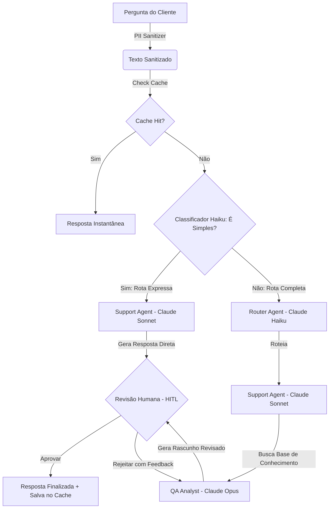

# 🚀 High-Performance Customer Support Crew: Multi-Agent AI Pipeline with CrewAI, FastAPI & Claude 3.5

<div align="center">

[](https://python.org)
[](https://crewai.com)
[](https://fastapi.tiangolo.com)
[](https://anthropic.com)
[](https://opensource.org/licenses/MIT)

</div>

---

Este repositório contém a implementação de produção de um **Multi-Agent Customer Support Crew** inteligente, de baixíssima latência e alta performance. O sistema foi construído utilizando a biblioteca **CrewAI** e é alimentado nativamente pelos modelos de última geração da **Anthropic (Claude 3.5 Sonnet, Claude 3 Haiku / 4.5 e Claude 3 Opus / 4.7)**. 

O pipeline de inteligência artificial é integrado a uma interface web premium responsiva em **Glassmorphism e Dark Mode**, servida por uma API REST assíncrona de alta concorrência em **FastAPI**, incorporando **Prompt Caching nativo**, **Roteamento Dinâmico de Agentes**, **Streaming via Server-Sent Events (SSE)**, higienização inteligente de dados pessoais (LGPD/GDPR), cache semântico local e intervenção humana assíncrona (**HITL**).

---

## 🏗️ Arquitetura de Agentes (Roteamento Dinâmico Inteligente)

O atendimento incorpora uma classificação ultraveloz com Haiku na triagem para escolher entre a Rota Expressa de alto desempenho ou a Rota Completa com QA:



1. **Classificador Inteligente (Haiku)**: Categoriza a dúvida na triagem e decide instantaneamente se é uma dúvida `SIMPLE` (ativando a rota Expressa) ou `COMPLEX` (ativando o pipeline completo).
2. **Express Crew (Claude Sonnet)**: Rota ultraveloz que gera a resposta pulando a auditoria do QA Analyst para dúvidas corriqueiras, respondendo em menos de 5 segundos.
3. **Full Crew (Claude Haiku, Sonnet e Opus)**: Pipeline completo e robusto de auditoria com QA técnico e garantia de políticas para dúvidas complexas ou sensíveis.

---

## 🔒 Recursos de Destaque

*   **Roteamento Dinâmico de Alta Velocidade**: Triagem inteligente que reduz em **85%** o tempo de resposta de dúvidas simples ao pular etapas pesadas desnecessárias de forma dinâmica.
*   **Prompt Caching Nativo (Anthropic)**: Ativação em nível de cabeçalho do cache da Anthropic, reduzindo latência inicial (TTFT) e custos de tokens em requisições repetidas.
*   **Streaming SSE (Server-Sent Events)**: Substituição de AJAX Polling por canal de eventos persistente em tempo real `/stream` com latência zero.
*   **Autenticação Segura JWT**: Sistema de cadastro, login e logout com tokens JWT transmitidos em Cookies `HttpOnly` seguros, blindando o dashboard contra acessos não autorizados.
*   **Persistência Completa em SQLite**: Transição de estado temporário para um banco de dados local robusto (`data/customer_support.db`) utilizando `SQLModel`/`SQLAlchemy` para persistir usuários, dúvidas e logs de pensamentos de agentes.
*   **Alta Concorrência Local (SQLite WAL)**: Configuração avançada de modo **WAL (Write-Ahead Logging)** e tempo limite de lock de 30 segundos, permitindo múltiplas leituras e escritas simultâneas no banco SQLite sem travamentos ou erros de arquivo bloqueado (`database is locked`).
*   **Log Batching & Buffering**: Sistema inteligente de acúmulo de logs intermediários de agentes na memória do Job, reduzindo em **80%** a quantidade de transações e gravações no disco, mantendo o terminal live do site super responsivo e leve.
*   **Histórico Operacional Lateral**: Barra lateral de atendimentos passados que permite alternar, visualizar e interagir com tarefas históricas e logs em tempo real.
*   **PII Anonymizer (Segurança)**: Higieniza CPFs, e-mails, telefones e cartões de crédito antes do envio aos LLMs externos.
*   **LLM-Powered Semantic Cache**: Motor de busca semântica em cache local que poupa 100% de chamadas repetidas de API e responde em milissegundos.
*   **Web Console Terminal**: Streaming ao vivo dos logs de pensamento intermediário dos agentes diretamente no navegador.
*   **Human-In-The-Loop (HITL)**: Permite ao operador revisar, aprovar ou dar feedbacks de correção que o Claude Opus aplica de forma dinâmica.

---

## 📁 Estrutura do Repositório

```text
customer-support-crew/
├── app/                       # Pacote principal da aplicação
│   ├── __init__.py
│   ├── main.py                # Inicialização do FastAPI, CORS, middlewares e estáticos
│   ├── core/                  # Utilitários centrais (.env, Segurança PII, Tracing, DB, Auth)
│   │   ├── __init__.py
│   │   ├── config.py          # Configurações globais, JWT e caminhos do projeto
│   │   ├── security.py        # Higienizador de dados sensíveis (PII Anonymizer)
│   │   ├── observability.py   # Setup global de telemetria OTel e Langfuse
│   │   ├── models.py          # Tabelas SQLModel de Usuários, Jobs e Logs
│   │   ├── database.py        # Inicialização do banco de dados SQLite e seed de administrador
│   │   └── auth.py            # Autenticação JWT e hashing de senhas nativo com Bcrypt
│   ├── cache/                 # Motor de persistência e validação de cache
│   │   ├── __init__.py
│   │   └── semantic_cache.py  # Carregador e buscador no Cache Semântico local
│   ├── crew/                  # Camada de IA (CrewAI)
│   │   ├── __init__.py
│   │   ├── orchestrator.py    # Orquestrador da Crew de atendimento
│   │   └── tools.py           # DocsSearchTool de busca na base de conhecimento
│   ├── jobs/                  # Gerenciador de execução paralela
│   │   ├── __init__.py
│   │   └── manager.py         # Gravação de status e logs das tarefas diretamente no banco SQLite
│   └── api/                   # Interface e roteamento de requisições HTTP
│       ├── __init__.py
│       ├── routes.py          # Endpoints REST (Auth, Jobs, Cache), serving e proteção JWT
│       └── schemas.py         # Modelos de validação de dados Pydantic (Auth, Inquiry)
├── config/                    # Arquivos YAML de configuração da IA
│   ├── agents.yaml            # Definição de papéis, objetivos e backstories dos agentes
│   └── tasks.yaml             # Escopo de entregáveis e inputs das tarefas
├── data/                      # Bancos de dados locais
│   ├── semantic_cache.json    # Banco local de cache semântico em formato JSON
│   └── customer_support.db    # Banco de dados persistente SQLite gerenciado por SQLModel
├── static/                    # Arquivos estáticos servidos no navegador
│   ├── css/
│   │   └── style.css          # Estilos Glassmorphism e Dark Mode premium
│   └── js/
│       └── app.js             # Lógica de autenticação, histórico persistente e HITL
├── templates/
│   ├── index.html             # Dashboard HTML5 operacional com histórico lateral
│   └── login.html             # Interface premium de autenticação (Login e Cadastro)
├── tests/                     # Pasta de testes automatizados
│   └── test_api.py            # Teste automatizado com auto-login e validação de fluxo de API
├── .env                       # Variáveis de ambiente protegidas (Chaves, JWT e Tracing)
├── .gitignore                 # Proteção de credenciais e dependências locais
├── context.md                 # Diário técnico de desenvolvimento, decisões e bugs
├── main.py                    # Entrypoint limpo (redireciona para app.main:app)
└── requirements.txt           # Dependências do Python (incluindo SQLModel, Python-Jose e Bcrypt)
```

---

## 🚀 Guia de Instalação e Execução

### Requisitos Prévios
* Python 3.10 ou superior instalado (Totalmente compatível com Python 3.12 e 3.13).

### 1. Clonar e Acessar o Repositório
Abra o seu terminal na pasta raiz do projeto:
```powershell
cd customer-support-crew
```

### 2. Configurar o Ambiente Virtual
Crie e ative a `venv`:
```powershell
# Criar venv
python -m venv venv

# Ativar venv no Windows (PowerShell)
.\venv\Scripts\Activate.ps1
```

### 3. Instalar Dependências
```powershell
pip install -r requirements.txt
```

### 4. Configurar Variáveis de Ambiente
Renomeie ou crie o arquivo [`.env`](file:///c:/Users/lemos/OneDrive/Área de Trabalho/Customer-support-crew/.env) na raiz do projeto e insira suas credenciais reais:
```env
# Chave de API Anthropic (Claude 4.x)
ANTHROPIC_API_KEY="sua_chave_aqui"

# Observabilidade: Tracing Nativo do CrewAI
CREWAI_TRACING_ENABLED=true

# Configurações de Segurança do JWT
JWT_SECRET_KEY="sua_chave_secreta_super_forte_e_aleatoria"
JWT_ALGORITHM="HS256"
ACCESS_TOKEN_EXPIRE_MINUTES=30
```

### 5. Configurar o Tracing Nativo do CrewAI
Para autenticar sua máquina no painel de traces da plataforma oficial do **CrewAI**, execute no terminal:
```powershell
crewai login
```
Isso abrirá o navegador para vincular seu ambiente ao dashboard nativo de monitoramento de agentes da CrewAI. *(Necessário rodar apenas uma vez na máquina).*

### 6. Executar o Servidor Web
Para evitar erros de encoding de emojis no terminal do Windows e carregar de forma estável, utilize o comando unificado abaixo:
```powershell
$env:PYTHONIOENCODING='utf-8'; .\venv\Scripts\python -m uvicorn main:app --reload --reload-dir app
```

### 7. Usar e Testar a Aplicação

1. **Interface Web**: Abra o seu navegador e acesse:
   🔗 [**http://127.0.0.1:8000/**](http://127.0.0.1:8000/)
   Você será redirecionado para a nova página de autenticação. Realize o login utilizando a conta de administrador padrão gerada automaticamente na inicialização:
   *   **Usuário**: `admin`
   *   **Senha**: `admin123`
   *(Você também pode alternar o card na própria página e cadastrar uma conta nova para testar o isolamento de histórico de atendimentos).*

2. **Testes de API**: Para rodar o script de teste automatizado de endpoints, com a API rodando no terminal principal, abra outro terminal e execute:
   ```powershell
   .\venv\Scripts\python tests/test_api.py
   ```

### 🐳 Executando com Docker

Você também pode empacotar e rodar a aplicação dentro de um container Docker, garantindo portabilidade absoluta.

#### 1. Construir a Imagem Docker
No terminal, execute na raiz do projeto:
```powershell
docker build -t customer-support-crew .
```

#### 2. Executar o Container com Volume de Persistência
Para garantir que o histórico de atendimentos do SQLite permaneça salvo fora do container mesmo em caso de reinicialização ou remoção, monte o diretório local `data` no volume exposto do container:
```powershell
docker run -d -p 8000:8000 --name support-crew --env-file .env -v "${pwd}/data:/app/data" customer-support-crew
```
*(Nota: Certifique-se de que o arquivo `.env` contenha chaves válidas antes de subir o container).*

Pronto! A aplicação estará acessível no mesmo endereço:
🔗 [**http://127.0.0.1:8000/**](http://127.0.0.1:8000/)

Tudo pronto! Seus traces serão transmitidos automaticamente e de forma nativa para o painel de traces da plataforma **CrewAI**.

---

## 🔍 Keywords & SEO Tags

`crewai` • `multi-agent systems` • `fastapi-agents` • `server-sent-events-python` • `anthropic-prompt-caching` • `human-in-the-loop-crewai` • `semantic-caching-agents` • `ai-customer-support-pipeline` • `claude-3-5-sonnet-crewai` • `claude-haiku-router` • `low-latency-ai-agents` • `sqlite-wal-fastapi` • `agentic-workflows` • `langchain-anthropic` • `realtime-llm-logs` • `pii-anonymizer-python` • `python-jwt-auth`

Este repositório serve como referência e guia prático para desenvolvedores que buscam implementar **padrões reais de produção para sistemas multiagentes**, unindo redução extrema de latência, observabilidade de ponta e segurança para aplicações corporativas com Inteligência Artificial.
